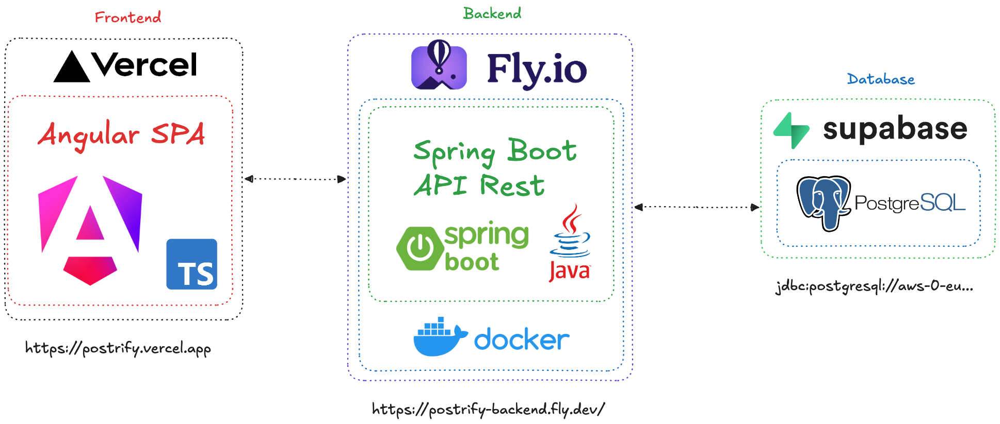

### Architecture

The frontend is a SPA built with Angular and deployed in Vercel (https://postrify.vercel.app/). The backend is a REST API built with Spring Boot (using Java) and deployed in Fly.io (https://postrify-backend.fly.dev/). The frontend and backend communicate through HTTPS requests. The backend is connected to a PostgreSQL database hosted in Supabase.

For development environment, the frontend is served by a local server running in port 4200. The backend is served by another local server running in port 8080. The frontend and backend communicate through HTTP requests. The backend is connected to a PostgreSQL database running locally in port 5432.
